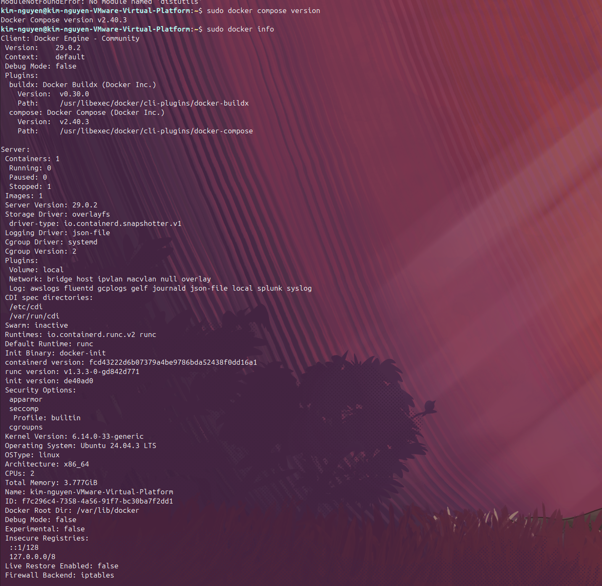
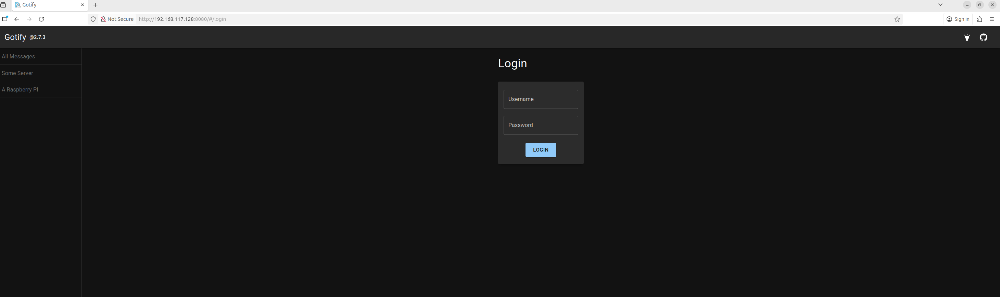
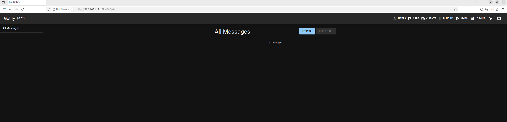

## Installing Docker
1. Remove all (if any) docker files from VM using:
```
sudo apt remove $(dpkg --get-selections docker.io docker-compose docker-compose-v2 docker-doc podman-docker containerd runc | cut -f1)
```
2. Installing using the apt repository
   - set up Docker's apt repository
```
sudo apt update
```
```
sudo apt install ca-certificates curl
```
```
sudo install -m 0755 -d /etc/apt/keyrings
```
```
sudo curl -fsSL https://download.docker.com/linux/ubuntu/gpg -o /etc/apt/keyrings/docker.asc
```
```
sudo chmod a+r /etc/apt/keyrings/docker.asc
```
3. Add the repository to the Apt sources
```
sudo tee /etc/apt/sources.list.d/docker.sources <<EOF
Types: deb
URIs: https://download.docker.com/linux/ubuntu
Suites: $(. /etc/os-release && echo "${UBUNTU_CODENAME:-$VERSION_CODENAME}")
Components: stable
Signed-By: /etc/apt/keyrings/docker.asc
EOF
```

-ensure the file exists before continuing
```
ls -l /etc/apt/sources.list.d/docker.sources
```

-update the system
```
sudo apt update
```

4. Install the Docker packages
   - install the latest version with command
```
sudo apt install docker-ce docker-ce-cli containerd.io docker-buildx-plugin docker-compose-plugin
```
- verify that Docker is running
```
sudo systemctl status docker
```
5. Check that the installation was successful by running the "hello-world" image
```
sudo docker run hello-world
```
6. Check for Docker version
   - install docker-compose
```
sudo apt install docker-compose
```
```
sudo docker compose version
```
```
sudo docker info
```


## Setting up Gotify in Docker
1. Create a parent directory for Gotfiy
```
mkdir -p ~/docker-projects/gotify
```
```
cd ~/docker-projects/gotify
```
2. Create and edit the docker-compose.yml file
```
nano docker-compose.yml
```
3. Edit the file to include these lines:
```
version: '3.8'

services:
  gotify:
    image: gotify/server:latest
    container_name: gotify
    ports:
      - "8080:80"
    volumes:
      - ./data:/app/data
    environment:
      - GOTIFY_DEFAULTUSER_NAME=admin
      - GOTIFY_DEFAULTUSER_PASS=adminpassword
```
   - the environment section in the "services" block set up the login used to access gotify
4. Start the stack
```
sudo docker compose up -d
```
5. Make sure it's running
```
sudo docker compose ps
```

6. open your web browser and type in "http://<your_ip_address>:8080" to check if it is set up correctly
```
http://192.168.117.128:8080
```
   - the webpage should look like this:

7. Log in using the credentials you initialized in your docker-compose.yml file:
	Username: admin
	Password: adminpassword
8. You are now logged in, and you should see:

